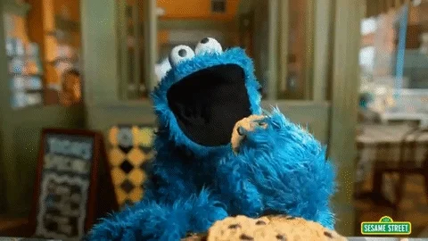

What is this?
=============

Aside from being some aggressive marketing for cookies, this is a project
template designed to make it easy to start projects that use the C (or C++)
programming languages.

It's aimed mostly at people new to the C language and will hopefully save
the users a lot of time and pain that would otherwise be required to learn
and setup various parts of the tooling and build system.
