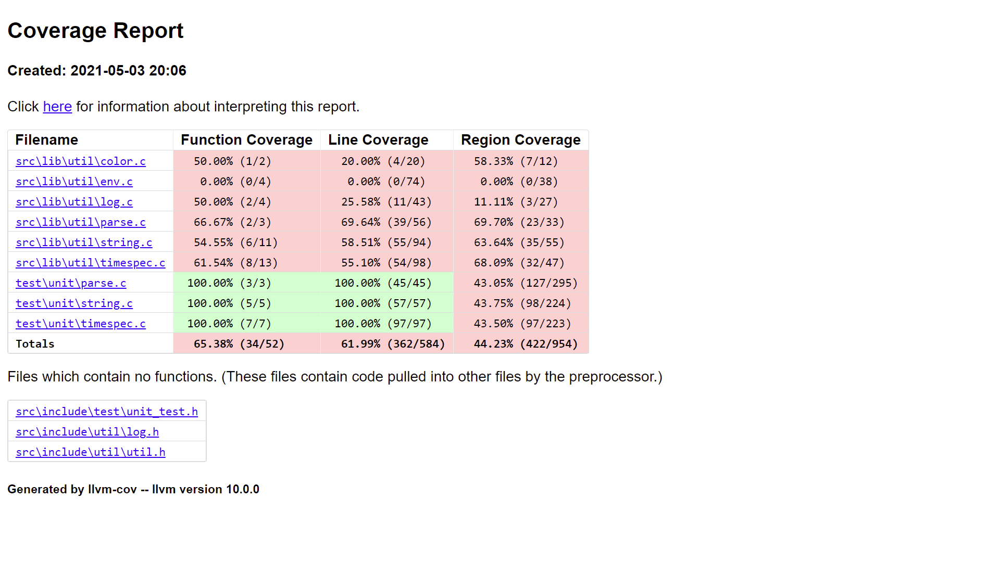
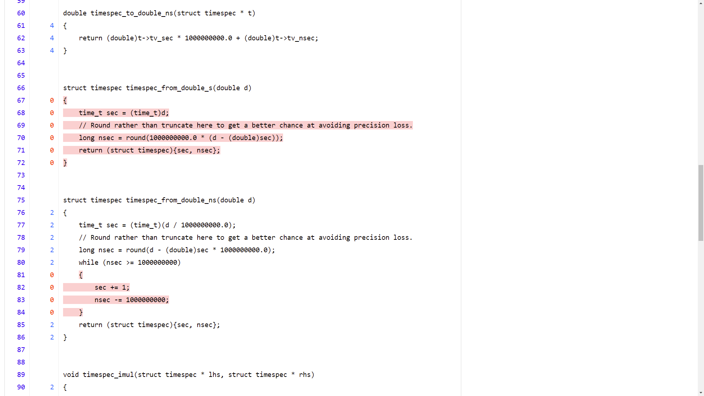

Test
====

|:scales:| Unit Test
--------------------

This template project includes a minimal test framework. See :ref:`unit_test.h`
for API documentation. To add a new unit test, start by creating a new .c file
in the ``tests/unit`` directory, e.g: :file:`test/unit/char.c`:

.. code-block:: c

    #include <ctype.h>

    #include "test/unit_test.h"

    static void test_tolower()
    {
        CHECK(tolower(' ') == ' ');
        CHECK(tolower('A') == 'a');
        CHECK(tolower('Z') == 'Z');
        CHECK(tolower('a') == 'a');
        CHECK(tolower('z') == 'z');
    }

    int main()
    {
        test_tolower();
        success("All tests passed :-)");
        return 0;
    }

And then in the :file:`test/unit/CMakeLists.txt` file add a line like:

.. code-block:: cmake

    add_unit_test(test_char unit/char.c)

And finally to run your test:

.. code-block:: console

    $ ninja -j16
    $ ctest -R ^test_char$

.. note::

    The command format is ``ctest -R <regex>`` so any valid regex will work.
    ``^`` matches the start of the string and ``$`` matches the end, and using
    them prevents us from accidentally matching tests that have ``test_char``
    in the name.

which will print:

.. code-block:: console

    Test projectpath/to/your/build
        Start 3: test_char
    1/1 Test #3: test_char ........................***Failed    0.03 sec

    0% tests passed, 1 tests failed out of 1

    Label Time Summary:
    unit_test    =   0.03 sec (1 test)

    Total Test time (real) =   0.61 sec

    The following tests FAILED:
            3 - test_char (Failed)
    Errors while running CTest

This isn't very helpful by itself because it didn't show us the test output.
Now we can either run the failing test directly (without ``ctest``):

.. code-block:: console

    $ test\unit\test_char.exe
    Error: CHECK(char_to_lower_case('Z') == 'Z') failed
       in: test_char_char_to_lower_case
       at: ../test/unit/char.c:19

or tell ``ctest`` to give us the output:

.. code-block:: console

    $ ctest -R ^test_char$ --output-on-failure
    Test project path/to/your/build
        Start 3: test_char
    1/1 Test #3: test_char ........................***Failed    0.01 sec
    Error: CHECK(char_to_lower_case('Z') == 'Z') failed
    in: test_char_char_to_lower_case
    at: ../test/unit/char.c:19

    0% tests passed, 1 tests failed out of 1

    Label Time Summary:
    unit_test    =   0.01 sec (1 test)

    Total Test time (real) =   0.04 sec

    The following tests FAILED:
            3 - test_char (Failed)
    Errors while running CTest

Now its time to crack open your favourite debugger and fix the test.

.. image:: ../_images/computer_dumpster.gif
   :alt: A man throwing his computer into a dumpster.
   :width: 100%

.. note::

    `CTest`_ is a powerful tool and has many useful options such as:

    - ``--verbose``: print out the exact command that ran the test.
    - ``-j N``: run ``N`` tests in parallel.

.. _`CTest`: https://cmake.org/cmake/help/latest/manual/ctest.1.html

|:see_no_evil:| Coverage
------------------------

The ``COVERAGE`` cmake flag instruments the source code so that when it's
executed it generates ``<name>.profraw`` files. After configuring your build
with this flag build the ``coverage`` target, which will: execute ``ctest``,
merge the multiple profiles and produce a HTML report of test coverage in the
``<build>/coverage`` directory. Open ``<build>/coverage/index.html`` in a web
browser to see the report, which will look like:

and clicking on a single file shows the line-by-line coverage:

The ``coverage`` target expects to use the `llvm-cov`_ and `llvm-profdata`_
tools, and will fail if CMake cannot find them. These tools are typically
packaged alongside clang/LLVM.

.. note::

    Files that are unused by tests do not show up in the coverage report,
    so actual project coverage may be lower than what is reported.

.. _llvm-cov: https://llvm.org/docs/CommandGuide/llvm-cov.html
.. _llvm-profdata: https://llvm.org/docs/CommandGuide/llvm-profdata.html

|:race_car:| Performance
------------------------

This template project also includes a very simple micro-benchmark framework,
with a couple of examples. See :ref:`benchmark.h` for the relevant API documentation.

One example is the ``benchmark_parse`` target, which benchmarks some of the code in the ``parse.c``
file. You can run the target manually:

.. code-block:: console

    $ build/test/benchmark/benchmark_parse.exe
    bench_parse_bool
    --------------------------+-----------+-----------+-----------+-----------+-----------+-----------
     name                     |      mean |    stddev |       min |        1% |       99% |       max
    --------------------------+-----------+-----------+-----------+-----------+-----------+-----------
     overhead                 |         1 |         0 |         1 |         1 |         1 |        18
     parse_bool(true)         |        12 |         6 |        10 |        10 |        37 |       103
     parse_bool(1)            |        14 |         5 |        12 |        12 |        43 |        82
     parse_bool(on)           |        18 |         5 |        16 |        16 |        44 |        84
     parse_bool(false)        |         5 |         2 |         5 |         5 |        12 |        71
     parse_bool(0)            |         8 |         3 |         6 |         6 |        24 |        26
     parse_bool(off)          |        12 |         8 |        10 |        10 |        41 |       195

or with ``ctest`` (like a unit test). All measurements are printed with units of nano-seconds.

The numbers to pay most attention to are probably the 1st and 99th percentiles as they tend to be
more stable than the ``min`` and ``max`` while still being a good proxy for them. The ``max`` and
``stddev`` columns are good for getting a feel for the amount of jitter in the benchmarks.

The ``overhead`` row represents the benchmark running a function that does nothing. It attempts to
capture systematic errors due to clock-resolution and the overhead of executing the benchmark
harness. It is unlikely to be a good estimate for the random components of the error.

At the moment the benchmark harness uses ``timespec_get(..., TIME_UTC)`` to obtain its time points,
however this is subject to host clock-adjustments and limited by host clock precision. As such,
these numbers should be taken with a (large) pinch of salt.

.. warning::

    Benchmarking is fiddly and this micro-benchmark framework has a very primitive
    implementation. If you're going to be doing lots of benchmarking it's
    probably worth using a high-quality third-party project, such as `google benchmark`_ instead.

.. _`google benchmark`: https://github.com/google/benchmark
